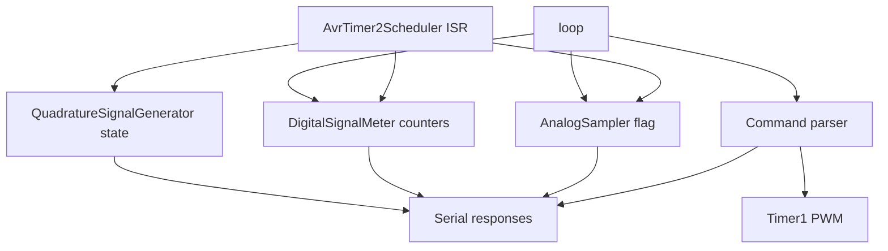

# PlatformIO Arduino Uno Project

Basic PlatformIO project targeting the Arduino Uno (ATmega328P).

## IOFusion design

IOFusion is a small set of hardware helpers focused on small-footprint, timer-driven signal processing and generation:

- `AvrTimer2Scheduler` provides a periodic ISR tick for scheduling fast tasks.
- `AnalogSampler` defers ADC reads to `loop()` while the ISR only sets a flag.
- `DigitalSignalMeter` samples digital inputs in the ISR and computes frequency/duty in `loop()`.
- `QuadratureSignalGenerator` produces a quadrature output and tracks position/direction.
- `AvrTimer1Pwm` configures Timer1 PWM on OC1A/OC1B (pins 9/10) and drives both outputs low when stopped.

### Digital measurement semantics

`DigitalSignalMeter` is intended to observe externally driven push-pull logic only. The monitored pins are measurement inputs, not contact inputs, and they should be driven actively LOW and HIGH by the upstream device.

The runtime default now makes the pull-up policy explicit: digital measurement starts with internal pull-ups disabled (`usePullup = false`). That matches the intended use case of externally driven push-pull sources and avoids silently biasing the observed signal.

Integration requirement: do not connect passive switches, open-drain, open-collector, or otherwise weakly biased sources directly unless the external interface first converts them into a clean push-pull logic signal suitable for AVR digital sampling.

In the current firmware configuration, these channels run with a `10 kHz` sampling tick and a `500`-sample window (`50 ms`). Frequency and duty reporting now use a hybrid strategy: if the current window contains at least three rising edges, the firmware uses the completed periods between the first and last rise in that window to estimate frequency, while duty remains the window average; if edges are sparser than that, it reports both values from the same most recently completed cycle measured between rising edges. This removes the old `20 Hz` quantization floor for slow signals without overstating frequency at the handoff boundary.

Practical capacity with the default window:

- Input type: externally driven push-pull digital logic referenced to the Uno ground
- Sampling rate: `10 kHz`
- Reporting window: `50 ms`
- Update cadence: about `20` reports per second
- Low-frequency behavior: can report below `20 Hz`, but only after two rising edges have been observed and one complete cycle has been measured
- Mode handoff: windows with only one or two rising edges stay on the cycle-based estimator; denser windows switch at three or more rises, with frequency computed from completed rise-to-rise periods inside that window
- Stop detection: a stale frequency is cleared after roughly two expected periods without a new rising edge
- Duty-cycle behavior: low-rate duty comes from the same last completed cycle as low-rate frequency; denser signals still use the window average
- Duty-cycle resolution: `0.1%` in the reported value, with accuracy limited by the `100 us` sampling interval
- Practical frequency range: low single-digit hertz up to about `1 kHz` if you want credible sampled measurements; several kilohertz is theoretically detectable but increasingly phase- and quantization-limited

This design still is not a hardware input-capture meter. Very slow signals need time to accumulate two edges, and very fast signals are limited by the `100 us` sample interval. If you need better than that, use a longer window for smoother duty reporting or move to timestamped edge capture.

### Encoder generator semantics

`QuadratureSignalGenerator` is a **signal generator** driven by two active-high control inputs (`up`, `down`) with internal pull-ups enabled. It advances one quadrature step per tick when `up` is asserted HIGH and `down` is idle LOW, and steps backward when `down` is asserted HIGH and `up` is idle LOW. It does **not** decode a physical quadrature encoder.

Integration requirement: these control inputs are intended for push-pull logic sources that actively drive LOW when idle and HIGH when asserted. They are not intended for passive buttons, open-drain, or open-collector wiring in the usual Arduino `INPUT_PULLUP` pattern.

If your upstream source cannot actively drive LOW when idle, do not wire it directly to this interface as currently defined. In that case, either add an external buffer/translator that presents a push-pull active-high signal to the Uno, or change the firmware contract to active-low semantics.

Direction and position are intentionally treated as lightweight status values rather than an atomic snapshot pair. For this design that is acceptable because the generator is expected to move relatively slowly, so hosts should treat encoder reporting as near-real-time status.

### Data flow




### Timing model

- **ISR path:** minimal work only (flags + counters). No floating-point math.
- **Main loop:** performs ADC reads and computes frequency/duty, ensuring the ISR stays fast.

#### Timing contract (important)

To keep measurements accurate, `loop()` should run frequently. If the loop stalls for long periods, analog refresh and digital window updates will lag. As a rule of thumb, keep worst-case loop latency well below the digital measurement window duration.

On this Uno-focused design, serial command handling is synchronous in `loop()`. If a host polls aggressively, especially with repeated `digital?`, `status`, or `capabilities` requests, command parsing and response formatting can delay when the next digital measurement window is re-armed. For conservative integration, treat about `1` poll per second as the recommended steady-state host query rate unless you have profiled your exact traffic pattern on target hardware.

Higher polling rates can still work in some deployments, but they are not a safe default on an ATmega328P. If you increase the host polling rate, validate that digital measurements do not pause or become stale under worst-case serial traffic.

This polling guidance is intentionally a documented integration contract only. It is not surfaced through `status`, `capabilities`, or any other runtime metadata because the firmware cannot reliably infer or enforce host-side traffic policy on its own.

The analog subsystem is intentionally best-effort rather than fixed-rate. Timer ticks only request a refresh, and `loop()` performs ADC work whenever time is available. If multiple ticks arrive while the CPU is busy, those requests are coalesced and only the latest completed analog snapshot is retained.

In the default firmware configuration, the Timer2 base tick remains `10 kHz` for digital measurement and generator timing, but analog refresh requests are decimated to one request every `100 ms`. This keeps ADC work aligned with the actual freshness requirement instead of requesting unsustainable full-channel refreshes on every timer tick.

The same default Timer2 settings also define the digital measurement capacity: the firmware samples input level every `100 us` and publishes one reduced measurement window every `50 ms`. When that window does not contain enough edges, both frequency and duty fall back to the most recent completed cycle instead of mixing cycle-based frequency with window-based duty.

Sparse stale timeout also tracks ISR tick time even if a completed window is still waiting for loop-side publication. That avoids keeping an old sparse-cycle result alive indefinitely just because the host or main loop delayed the next `updateIfReady()` call.

Because the measurement block is published from `loop()`, not directly from the ISR, host query rate matters. Even though the internal window cadence is about `20` updates per second, you should not assume the host should poll anywhere near that rate. A conservative recommendation is about `1` `digital?` query per second on Uno-class hardware unless you have measured headroom on the real device.

At boot, analog values are not refreshed immediately. Hosts should allow for the firmware startup delay plus the first analog refresh interval before treating `analog?` data as fresh. With the default configuration, that means analog readings can remain at their initial zero state for roughly the first `100 ms` after startup.

#### Analog reference voltage

`AnalogSampler` scales readings using a configurable reference voltage (default 5.0V). If your board uses a different $V_{ref}$, prefer `analogSampler.setVrefMillivolts(<mV>)` at startup after `begin()`. The float-based helper remains available, but the integer API is the better fit for AVR targets.

### Source layout

- Library headers: [lib/IOFusion/include](lib/IOFusion/include)
- Library sources: [lib/IOFusion/src](lib/IOFusion/src)
- Firmware entry: [src/main.cpp](src/main.cpp)
- Serial command protocol: [src/serial_command_protocol.h](src/serial_command_protocol.h) and [src/serial_command_protocol.cpp](src/serial_command_protocol.cpp)
- Active native unit tests: [test/iofusion](test/iofusion)

### Top-level runtime structure

The firmware entry point uses one static `FirmwareRuntime` composition root in [src/main.cpp](src/main.cpp). Board wiring and defaults are grouped into small static config structs (`PinMapConfig`, `EncoderConfig`, `TimingConfig`, `PwmConfig`, `RuntimeConfig`), and runtime module state is grouped in `ModuleHealth`.

This keeps the top level explicit without adding heap allocation, virtual dispatch, or other abstractions that are expensive on the ATmega328P.

`TimingConfig` now separates the fast Timer2 base rate from the analog refresh cadence, so digital edge timing can stay fast while analog updates are intentionally limited to a realistic freshness target.

Digital measurement defaults are also explicit in the runtime config through `DigitalMeasurementConfig`, which currently sets the reporting window and whether internal pull-ups are enabled for measured inputs.

Timer2 scheduler setup is reported as explicit success or failure. The implementation no longer treats `OCR2A = 0` as an error, because that is a valid compare value for the highest representable Timer2 rate.

## Command line interface

The firmware exposes a simple serial command line for querying sensors and controlling PWM. Commands are ASCII and are compact by default for machine-to-machine use on AVR. A more verbose debug protocol can be enabled at build time with `-DIOFUSION_PROTOCOL_DEBUG=1`.

Default compact response style:

- Success responses are terse payload objects such as `{"mv":[2502]}` or `{"ok":"pwm-duty"}`
- Error responses are compact objects such as `{"err":"invalid_frequency"}`
- Oversized serial frames are discarded until newline and ignored rather than truncated into another command

Debug response style with `IOFUSION_PROTOCOL_DEBUG=1`:

- Analog success: `{"api":"1","status":"ok","data":{"mv":[2502]}}`
- Digital success: `{"api":"1","status":"ok","data":{"f_dhz":[2500],"d_dpct":[500]}}`
- Status success: `{"api":"1","status":"ok","data":{"modules":{"analog":true,"digital":true,"encoder":true,"pwm":true,"timer2":true},"counts":{"analog":1,"digital":1}}}`
- Error: `{"api":"1","status":"error","error":{"code":"invalid_frequency","message":"frequency must be 1..1000000 hz"}}`

Supported commands:

- `analog?` — returns analog samples in millivolts as a compact ordered array (`mv`).
- `digital?` — returns frequency in deci-Hz and duty in tenths of a percent as compact ordered arrays.
- `encoder?` — returns compact encoder state.
- `pwm-freq <hz>` — sets Timer1 PWM frequency in integer Hz.
- `pwm-duty <ch> <pct>` — sets PWM duty for channel 0 or 1 using integer percent.
- `status` — returns compact module health and channel counts.
- `capabilities` — returns compact command list, unit metadata, and pin capabilities.
- `help` — prints a short help string.

Polling-rate guidance is not reported programmatically through `status` or `capabilities`; hosts are expected to follow the documented integration recommendation.

High-rate sensor responses use compact integer units to reduce serial traffic and avoid float formatting overhead on AVR:

- `analog?` payload: `mv` in millivolts, ordered by configured analog pin list
- Note: `analog?` reports the latest completed snapshot. Immediately after boot, that snapshot may still be the initial zero-filled state until the first scheduled analog refresh completes.
- `digital?` payload: `f` in $0.1\,\text{Hz}$ and `d` in $0.1\%$, ordered by configured digital pin list
- Note: `digital?` is intended for externally driven push-pull logic inputs. With the default `10 kHz` tick and `50 ms` window, results still update about every `50 ms`, but low-rate frequency and duty fall back to the most recent completed cycle once two rising edges have been seen.
- Note: for Uno-class deployments, keep steady-state host polling conservative. About `1` `digital?` request per second is the recommended default; substantially higher request rates can interfere with loop-side measurement publishing and should only be used after target validation.
- `encoder?` payload: `e` as `[dir, pos]` where `dir` is `1` for up and `0` for down. This is a compact status query, and the two values are read separately rather than documented as a transactional snapshot.
- `status` payload: `m` as `[analog,digital,encoder,pwm,timer]` and `c` as `[analogCount,digitalCount]`
- `capabilities` payload: `cmd` command list, `u` unit list, `p` PWM summary, `a` analog pins, `d` digital pins

Debug builds keep the same integer units, but use longer field names inside the response envelope: `mv`, `f_dhz`, `d_dpct`, `dir`, `pos`, `modules`, `counts`, `commands`, `units`, `pwm`, and `pins`.

Examples:

- `analog?` response: `{"mv":[2502,5000]}`
- `digital?` response: `{"f":[2500],"d":[500]}`
- `encoder?` response: `{"e":[1,42]}`
- `pwm-duty 0 50` response: `{"ok":"pwm-duty"}`

#### Error reporting

Initialization failures during startup are still printed as simple JSON error objects on Serial (for example, `{"error":"pwm init failed"}`) before the command protocol is active.

## Build and upload

Build with PlatformIO:

```bash
pio run
```

Upload to a connected Uno:

```bash
pio run --target upload
```

## Doxygen documentation

The public headers and firmware entry points include Doxygen-ready comments. Generate HTML documentation from the repository root with:

```bash
doxygen Doxyfile
```

Generated output is written to `docs/doxygen/html/index.html`.

## Unit tests and coverage

Host-based unit tests (IOFusion library) run under a native build with mocked Arduino APIs:

- Test support and Unity runner: [test/iofusion/test_support.h](test/iofusion/test_support.h), [test/iofusion/test_support.cpp](test/iofusion/test_support.cpp), and [test/iofusion/test_main.cpp](test/iofusion/test_main.cpp)
- Analog sampler tests: [test/iofusion/test_iofusion_analog_sampler.cpp](test/iofusion/test_iofusion_analog_sampler.cpp)
- Digital signal meter tests: [test/iofusion/test_iofusion_digital_signal_meter.cpp](test/iofusion/test_iofusion_digital_signal_meter.cpp)
- Quadrature signal generator tests: [test/iofusion/test_iofusion_quadrature_signal_generator.cpp](test/iofusion/test_iofusion_quadrature_signal_generator.cpp)
- Timer1 PWM tests: [test/iofusion/test_iofusion_avr_timer1_pwm.cpp](test/iofusion/test_iofusion_avr_timer1_pwm.cpp)
- Timer2 scheduler tests: [test/iofusion/test_iofusion_avr_timer2_scheduler.cpp](test/iofusion/test_iofusion_avr_timer2_scheduler.cpp)
- Serial command protocol tests: [test/iofusion/test_serial_command_protocol.cpp](test/iofusion/test_serial_command_protocol.cpp)

- Windows: run [tools/coverage.ps1](tools/coverage.ps1)
- Linux/macOS: run [tools/coverage.sh](tools/coverage.sh)

Reports are generated in the `coverage/` directory (`index.html` and `coverage.xml`).
